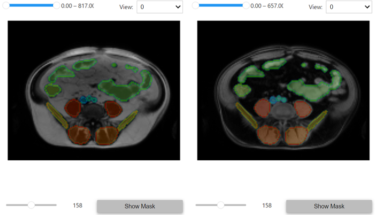

<h2 align="center"> AI-Assisted Healthcare Utility Scripts </h2>

***

<div align="center">
<a href="https://github.com/ai-assisted-healthcare/AIAH_utility/actions"></a>
<a href="https://github.com/ai-assisted-healthcare/AIAH_utility/blob/master/License.txt"></a>  
<a href="https://github.com/psf/black"></a>
</div>

## Container for:
- Dicom Reading
- Image Stitching
- 3D Image Viewing


## Installation

```bash
git clone https://github.com/ai-assisted-healthcare/AIAH_utility.git
cd AIAH_utility
python -m pip install -e .
```
## Usage


### Read, Stitch & View Dicom
```python
import SimpleITK as sitk
from AIAH_utility.dicom_io import read_dicom_series_zipped
from AIAH_utility.stitching import stitch_images
from AIAH_utility.viewer import BasicViewer

imgs, _manifest =  read_dicom_series_zipped("dicom.zip")
stitched_image = stitch_images(imgs)

stitched_image_np = sitk.GetArrayFromImage(stitched_image)
BasicViewer(stitched_image_np).show()
```

### View Nifti with Segmentation Map

```python
from monai.transforms import LoadImage
from AIAH_utility.viewer import BasicViewer, ListViewer

img = LoadImage()("image.nii.gz")
seg = LoadImage()("segmentation.nii.gz")

# Single Image
BasicViewer(img,seg).show()

# Multiple Images
ListViewer(
    [img1,img2, ...],
    [seg1,seg2, ...],
    figsize = (5,5),
    start_view = 0,
    cmap ="Greys_r"
).show()
```




